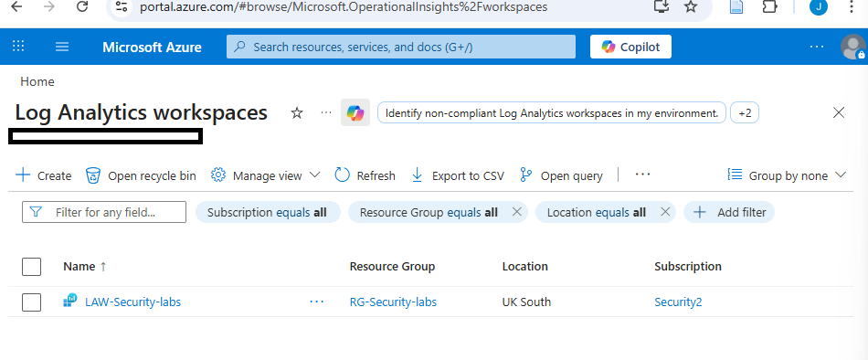
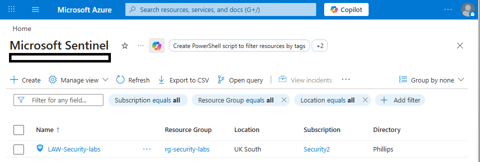
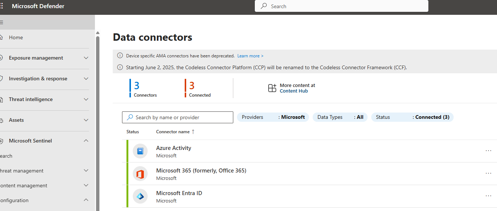
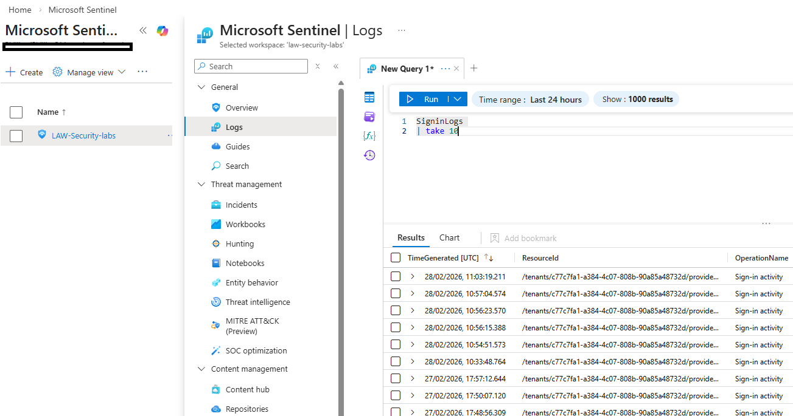
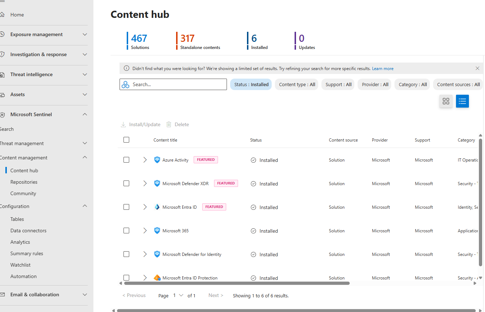
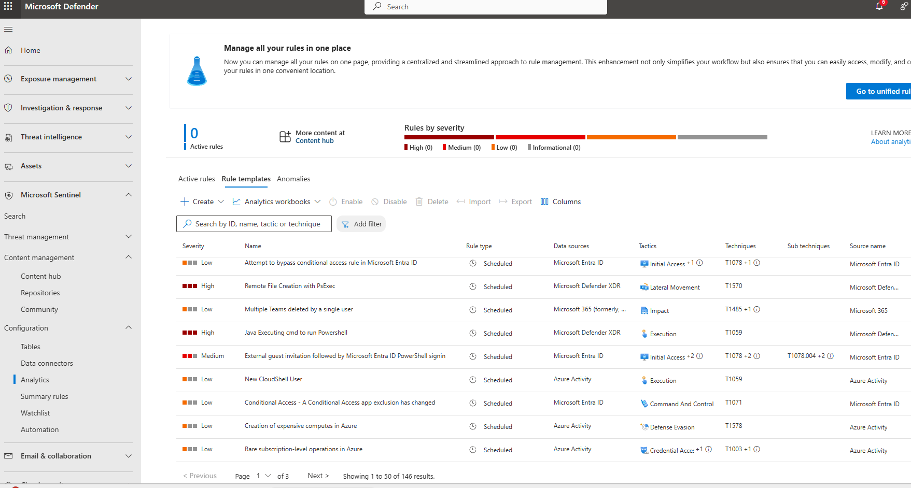
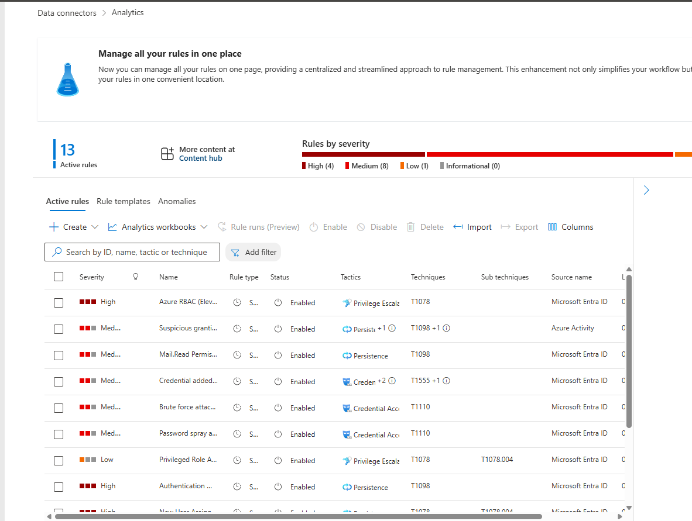

## Sentinel SIEM Deployment & Azure Logging Pipeline

### 🔧 Log Analytics Workspace Creation
The Log Analytics Workspace serves as the central data repository for Sentinel.

LAW supports:
- Log ingestion  
- KQL querying  
- Analytics rule evaluation  
- Threat hunting  
#### Screenshot showing Log Analytics Workspace

---

### 🛡️ Microsoft Sentinel Deployment

#### Screenshot - Sentinel enabled on LAW

---

### 🔌 Data Connector Configuration
The following connectors were successfully configured and verified:

- Azure Activity  
- Microsoft Entra ID   
- Microsoft Defender for Office 365  

#### Screenshot - data connectors configured

#### Screenshot - Sign‑in and audit logs in LAW 

 
---

## 📦 Content Hub Installation
Detection content was installed from the Content Hub, populating the **Analytics Rule Templates** section.
#### Screenshot - Content Hub Installed

#### Screenshot -  146 analytics rule templates available

---

### ⚠️ Analytics Rules Configuration
Templates do **not** generate incidents until converted into **active rules**.

Rules enabled:
- Multiple failed sign‑in attempts  
- Identity‑based detections  
- Azure role monitoring  
- MFA anomaly detection  
- Impossible travel  
- Suspicious sign‑in behaviour  
- Threat intelligence‑based rules  

#### Screenshot -  Analytical Rules

---

### 🔐 Access Control (RBAC)
Least‑privilege access was configured on the workspace.

Roles assigned:
- **Sentinel Contributor**  
- **Log Analytics Reader**  
- **Security Reader**  