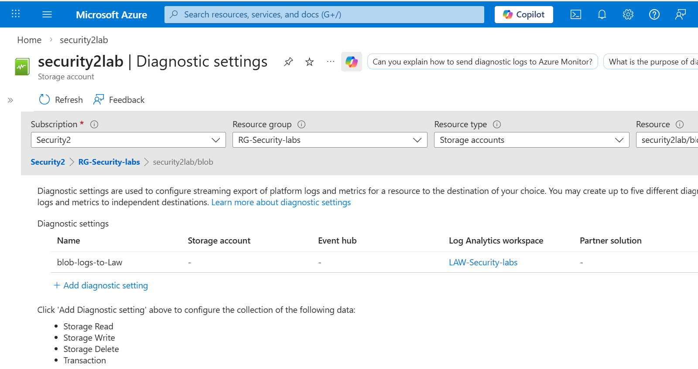
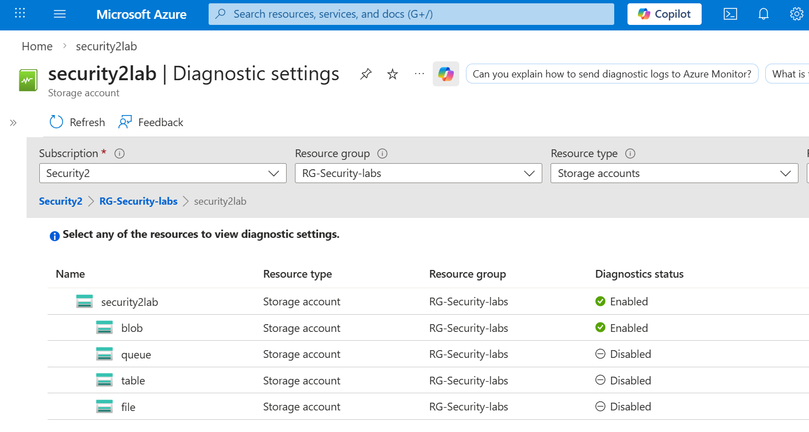

# Notes – Azure Resource Logging & Diagnostic Settings

## 1. Purpose of Diagnostic Settings
Many Azure services do **not** automatically send logs to Microsoft Sentinel.  
Diagnostic settings act as the pipeline that forwards **resource‑level logs** into the monitoring environment.

Without diagnostic settings enabled, infrastructure activity such as storage access, VM operations, or Key Vault usage may remain invisible to the SOC.

---

## 2. Log Sources Enabled
The following Azure resource logs were configured and forwarded to the Log Analytics Workspace:

### **Azure Storage – Blob Service Logs (StorageBlobLogs)**  
These logs capture:
- Blob uploads  
- Blob downloads  
- Blob deletions  
- Client IP addresses  
- Operation timestamps  

This telemetry supports detection of suspicious file access patterns and potential data exfiltration attempts.

---

## 3. Diagnostic Settings Configuration
The screenshot below shows the diagnostic setting applied to the **Blob service** of the storage account, confirming that logs are being forwarded to the **LAW‑Security‑labs** workspace.



A second screenshot confirms that **Storage** and **Blob** logging were successfully enabled, while other services (Queue, Table, File) remain disabled for this lab.



---

## 4. Log Ingestion Validation
The following KQL query was used to confirm that StorageBlobLogs were successfully ingested:

```kql
StorageBlobLogs
| sort by TimeGenerated desc
| take 20
