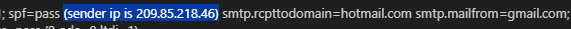
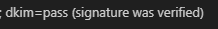
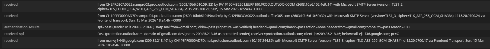

## 🗒️ Lab 03 — Analyst Walkthrough \& Commentary

## 🔍 Header Analysis

* SPF result: Pass
* DKIM result: Pass
* DMARC result: Pass
* Routing anomalies: None
* Return‑Path mismatch: None
* X‑Mailer observations:
#### The header includes:
* x-google-dkim-signature, x-gm-message-state and x-gm-features

### Commentary:

This email is a benign test message sent from a legitimate Gmail account. All authentication mechanisms (SPF, DKIM, DMARC) passed, the routing path is clean, and the infrastructure metadata matches Google’s normal sending behaviour. No indicators of spoofing, manipulation, or malicious infrastructure.

### Screenshots

#### SPF Result/Sender IP 

#### DKIM Result
dkim=pass header.d=gmail.com

#### DMARC Result 
dmarc=pass action=none header.from=gmail.com

#### Received (Routing Path)

#### Return‑Path vs From

#### X‑Mailer / X‑Google Metadata
[xmailer](./screenshots/06-x-mailer.png)

## 🌐 Infrastructure Findings

* Domain age:
* WHOIS registrant:
* Hosting provider:
* Geolocation:

#### Commentary:

?

## 🧪 VirusTotal Findings

### URL

* Detection ratio:
* Behaviour summary:
* Redirect chain:

### Attachment

* Static analysis:
* Sandbox behaviour:
* Dropped files:

#### Commentary:

?

## 🛡️ Sentinel/XDR Correlation

* Number of affected users:
* SafeLinks/SafeAttachments actions:
* Related alerts:

#### Commentary:

?

## 🧭 MITRE Mapping

* Put here

## 📝 Final Analyst Report

* here.

